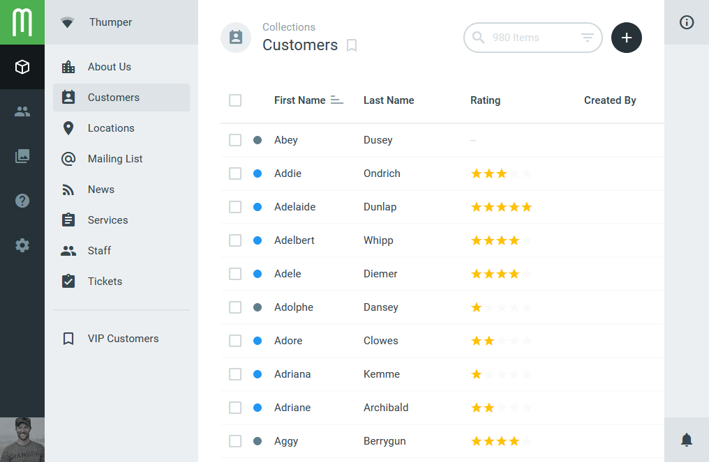
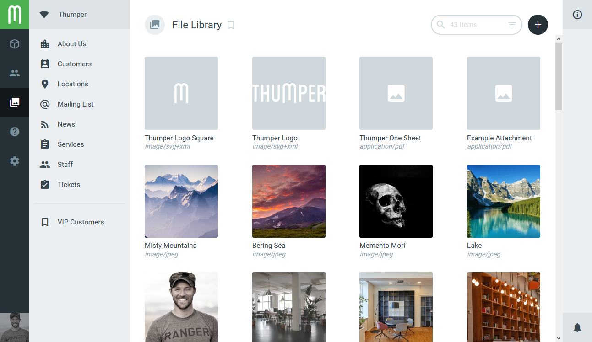
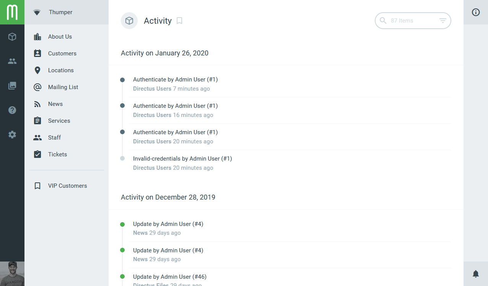

# Layouts

Layouts are different ways to view or even interact with data on the Item Browse page. Directus includes List and Card layouts out-of-the-box, but others can easily be created to fit specific needs.

::: tip
  To configure a layout, you have to click on the top right corner where an info icon is shown to open the side-menu.
:::

Following are the core layouts, which are already implemented into Directus and don't need to be installed. For more information about how to create your own layout, look [here](/extensions/layouts).

## List
The system default and fallback, this layout is a tabular view that will work with any type of data. It allows you to choose visible columns, sort by specific column data, reorder with drag-and-drop, and more.

### Options

- **Fields** - Change which field is shown in the layout and the order of the fields by using the drag and drop function.
- **Spacing** - The space between each entry.

## Card
Ideal for image-based collections, this layout showcases an image thumbnail with configurable text fields below. It is the default layout for the User Directory and File Library.

### Options

- **Sort by** - By which field should be sorted.
- **Sort Direction** - If the cards should be sorted ascending or descending.
- **Image Source** - The Image that will be displayed.
- **Fit** - How the image should be fitted inside the card.
- **Title** - Title of the card.
- **Subtitle** - Subtitle of the card.
- **Fallback Icon** - Which icon should be displayed when no image is set.

## Calendar
Shows you all your items in a Monthly overview, very useful for managing events or other time related information.

### Options

::: warning Note that...
...the Datetime and Date option don't have to be set at the same time. You only need to set one of them. The time option is not required either.
:::

- **Datetime** - Select which datetime should be used.
- **Date** - Select which date field should be used.
- **Time** - Select which time field should be used, if there exists one.
- **Title** - The title shown in the Calendar.
- **Color** - Allows to change the color of the event. Hex and directus colors are supported. E.g. `#1A2B3D`, `yellow-300` or `red-500`.  

## Timeline
Lists all events descending and groups them by day. It is present in the activity section of the admin settings but can be used anywhere.  

### Options

::: v-pre
- **Date** - Select by which date field each item should be grouped and sorted.
- **Title** - Set the title by writing the name of the field like so `{{ field_name }}`, this allows to have multiple fields as a title like `Event {{ field_one }} happened on {{ field_two }}`
- **Content** - Change the content displayed of each event.
- **Color** - Allows to change the color of the event. Hex and directus colors are supported. E.g. `#1A2B3D`, `yellow-300` or `red-500`.  
:::
